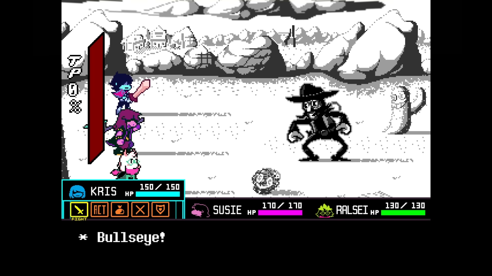
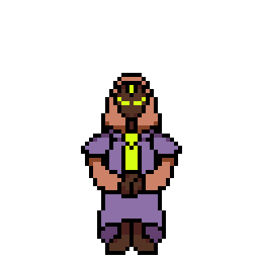
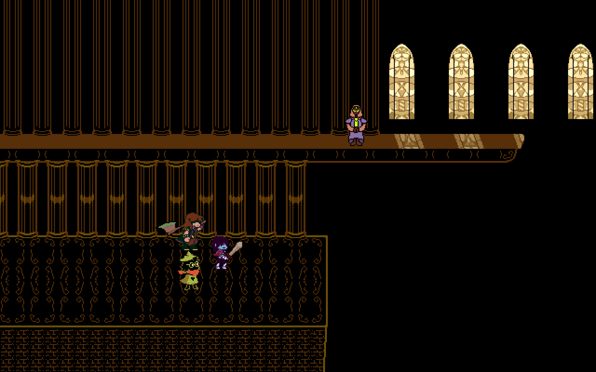
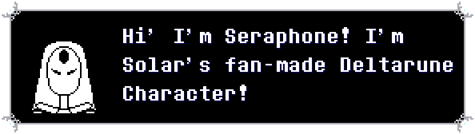
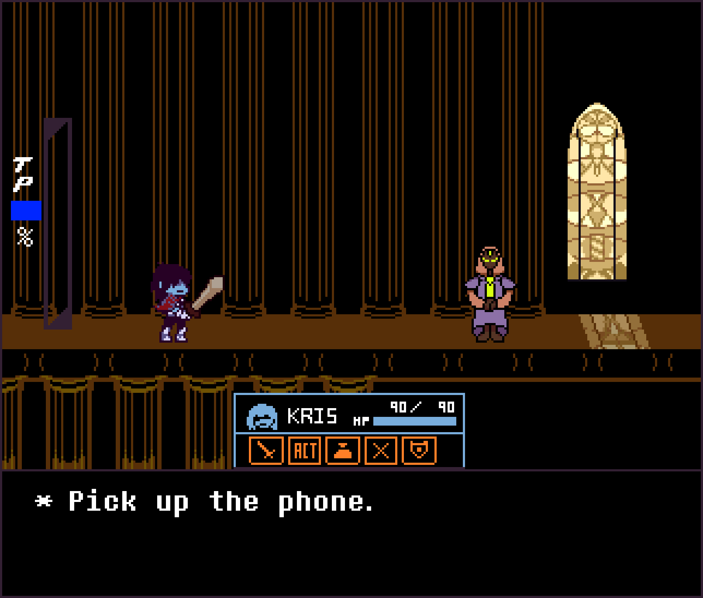
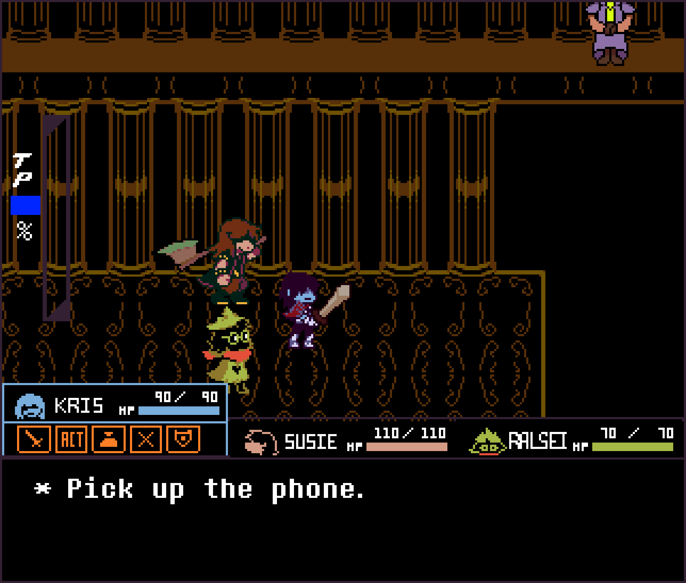

# Individual Project: Deltarune Secret Boss Concept

## Introduction *(200–300 words)*

- In this project, I decided to attempt to make a concept for a Deltarune-inspired boss. Having grown up with Toby Fox’s Undertale and adoring his work, I quickly fell in love with his parallel game, Deltarune. With the infamous style of his way of teasing his upcoming works, and inspired by a similar video of a fan-made creation, I decided to follow suit, and make my project a Deltarune-inspired boss design.

- As a long time fan of Toby Fox’s work, I’ve recently found his artwork to be simplistic yet charming; something that the gaming world is sorely lacking. At first appearance, it’s not uncommon to hear a common rhetoric that Undertale’s art is unappealing, even in comparison to similar-style retro SNeS games (such as Earthbound, a title he draws heavy amounts of inspiration from). Many sprites lack anti-aliasing, shapes and proportions are all over the place, and the game overall has a very “hand-made” feel. However, later in my life, I learnt to appreciate how endearing of a developer Toby Fox truly is. Not a coder or an artist by trade, but still wanting to use the medium of video games to express his ideas is a remarkable aspiration, which reminds me of the goals I personally resonate with when it comes to the creation of art. Moving to Deltarune, while the art has had a significant upgrade, it’s still charming to see while he is refining his craft, his style seems to be primarily in hand-crafted assets that get the concept across, and nothing more. I think the way he approaches his games is something that many developers could take from, myself included.

---

## 1. Time Planning

- While I didn’t create a definitive calendar, I knew from previous projects that structure is key. Without a solid foundation of the way I plan to execute my plan, it all falls apart quickly. With that in mind, I decided to focus on these areas in this particular order:
- Research
- Concept Sketches
- Production
- Finalising
- By trying to force myself to do things in an iterative order (rather than rushing straight to production and finalising), this forces me to think more about the core idea of my art, and make sure I’m using enough references. Using my previous projects as an example, oftentimes a strong plan keeps momentum running and workflow organised. It can especially help break work down, to help avoid scrambling work together at the last second.

- One big obstacle for me was the Easter Break. As someone who is very comfortable in routine, travelling home can often be stressful, as it’s not an environment that I associate with my Immersive Technology workflow. To combat this, I decided to spend more time at likeminded friend’s houses, and at the public library to break up my spaces for work and leisure. Overall, this helped me produce quality work during my time away, and ensured that the break wouldn’t disrupt my workflow.

---

## 2. Research

- For my idea, I decided to pull from the trailer for Deltarune: Chapter 3 + 4, in which the chapter’s world is clearly inside of a church. While the game doesn’t have much to pull from in terms of the church itself, the current chapters allude to something bigger in the world these characters live in. Many of the more important characters note the main protagonist, Kris, having a Soul, and have motifs of feeling controlled, wanting freedom, and higher powers. Going with this, I decided my character would be a false prophet, claiming to have connections to some kind of higher power using the motif of telephones. In Deltarune, Kis is given a telephone, although it serves no purpose (for now). I decided my character would have ties to this unused mechanic, being able to help the character by giving them hints and telling them how to reach them. Given this idea, I landed on the name “Seraphone”, a combination of seraph and phone. With this in hand, I decided to browse various art sharing platforms for character designs of a seraph in media.

- These pieces specifically spoke to me a lot; the combination of sharp edges combined with rounded shape gave the idea of a soft, yet powerful entity. Something that I quickly noticed was that a lot of these designs left the sex of the character quite ambiguous, which further fueled the idea of my character, that being a goal of connectedness, or a marriage of the world’s inhabitants and this higher being. Many of the other characters who are aware that something bigger is at play in Deltarune are usually either trying to break away from it or are scared of it, so I thought the idea that a character is not only fully trusting of these unknown higher forces, but actively trying to encourage people into it was a unique direction. I wanted the idea of marriage to be conveyed in both dialogue and design in many subtle ways, such as the combination of using both a dress, headpiece, feminine eyes and broad shoulders, a tie, or sharper shapes. 

- On top of designing the character, I also needed to find inspiration for the set design that you would find our character in. For this, I wanted to capture the feeling of tall cathedrals, with the ceiling often being several stories high, and large towering pillars. I drew a lot of inspiration from ancient greek architecture, such as the Parthenon and the Temple of Zeus, as well as the design of European cathedrals.

!A[rchitecture Reference 3](images/WinchesterCathedral.png)

- As an artist, it’s supremely important to survey what kinds of artwork is already out there and launch your thoughts into concepts, and concepts into pieces of work. Seeing the many different interpretations not only allows you to remember that a theme is inherently wide and open to individualistic interpretation, but also find specific ways said theme has been executed in ways that you personally feel is what you want to make.

---

## 3. Prototypes/Early Stages

- To begin with, I sketched the idea of the character onto paper, as it's a very quick way to fire out many ideas in a short span of time. Eventually, I got the basics of my character to a point I was happy with. Lots of smoothness contrasted with lots of sharpness, and an overall elegant yet not-too-aggressive look to the character, which was exactly the vision I had in mind. However, I knew that translating these qualities into a small canvas would be tricky. While basic shapes are relatively easy to create in pixel art, both sharpness and smoothness can be tricky to get right, especially without the help of a deep colour palette. 

- From there, I started to flesh out the design by moving to pixel art. I started with a more neutral colour tone to try and keep things neutral. I tried to make the dress more of a trench coat to keep the character’s design ambiguous by hiding the true shape of their body, and dramaticising the shoulders. I really liked the headpiece from the first reference and thought it added a feminine touch. Overall, while I enjoyed the direction of the character, one of the shapes could be either more rounded or more sharp, as none of the aspects really learned either side.

- Putting the design into pixel art showed how hard it was to capture the sharpness and the roundness of the design in such a small resolution, as well as avoiding simplifying everything down to straight lines. Even though the sketch didn’t feature any colours, it was clear that my palette choice didn’t quite convey what I had intended.

- In the second design, I reconsidered the colours, opting in for a more traditional pink and blue colour scheme to better highlight the idea of gender ambiguity in the design, colouring the more feminine features with pink and the masculine parts with blue. On top of this, I decided to add a gemstone to their head to further separate it from being too similar to other humanoid entities. As you can see in this (and the previous) image, I still wasn’t sure what I wanted the arms and hands to be positioned like. In the concept art, I had originally envisioned them holding a rock with the Delta Rune logo carved into it, perhaps being a falsely-perceived “gift” from this unknown higher force, but ultimately decided that the contrast of the technology of telephones conflicted too hard with the nature imagery of the rock, and thought it could be better conveyed another way, such as character attacks or dialogue. 

- Going forward, I knew that the colours still looked a little out of place, and the deliberate pink and blue was a little too on the nose. The dress was also starting to look out of place, as I’m not sure the jacket-style trenchcoat made the character’s personality really come across, giving more the feeling of secrecy than elegance. I also needed to work out the way the arms would work.

## 4. Production

- After many iterations deciding on colours and shapes, I finally landed with this design, something that I’m proud of, and feel like it’s polished enough to continue with. The colours slightly darker, and the shape of the dress has been completely overhauled; Unfortunately, the trench coat fold had to be scrapped, however I believe this design puts a bigger emphasis on the tie, which is now a neon green, a very deliberate colour which matches that of the stained glass windows seen on the sides of the church in Deltarune. This is also the first iteration of the character to have arms, legs and eyes, something that I felt would come naturally when the shape of the body felt right to accommodate it. To go along with the theme of the trailer, where the characters have an orange tint to them, I decided to make a version of the character that was tinted likewise:

- After studying more of the character designs, I realised that a lot of them have many “imperfection”, such as slightly mismatching proportion sizes, or missing large amounts of anti-aliasing, which I tried to show in this sprite while still attempting to keep it in a slightly more defined style.
- To circle back to the original concept art, I decided to create a basic attacking/stance animation, where Seraphone emerges their sharp, wing-like spikes from their back. I thought the added sharpness and aggression would further build on their visual design; A character who is seemingly quite harmless at first, suddenly revealing a hidden side to themselves that comes off as threatening.

- Now that the design was down, I needed to create a set of basic walking sprites for the character in 4 directions:

- I then had to create a scene for the fight to take place in. In Deltarune, many battles take place within a basic background, usually very disconnected from the actual area an enemy might have been encountered in. The usual exceptions to this are for secret bosses, so I only felt it appropriate that I made a unique area for you to fight this character in. To further emphasise the idea of forces from above, I decided to place the character on a platform, with the boss placed high on some pillars. This way, the attacks could revolve around hurtboxes falling from the ceiling, for example sound waves or beams of light that hurt the player. To fight this box, I imagined our protagonist, Kris, would have to employ the help of their party members to throw them up to the platform, allowing them to fight the enemy. However, this leaves Kris alone with the boss, who would slowly try to convert Kris now that they’re isolated.

- Typically in Deltarune, backgrounds that are used for battles (and backgrounds as a whole) are monochrome, and don’t feature many more than a handful of colours, most of which being the same colour. With this limitation, I created a simplistic background, using just two shades of yellow and black. The only exception is the glass stained windows, which use 6, and their reflections. I decided to add these because I thought it added a sense of light to the higher area, creating a further divide between the ground floor and the raised platform where the boss actually stands; The large, intricate platform with the brick texture, the pattern on the floor, and the larger, more pronounced pillars contrasted with the simpler raised area reflects on the character’s design and their intentions narratively.

## 5. Implementation

- Now that a large majority of the sprites were put into place, it was time to assemble them into the scene, and combine it with the UI. Using assets from the game, I added custom text to the UI, and created a custom text box icon for the character:

- I decided to make two separate final scenes for my project: One with the characters on the ground, just out of reach, and the other of Kris on top of the platform, separated from their teammates.

## 7. Conclusion

- In conclusion, while I was overall satisfied with the idea of the project, I definitely could have used a bit more direction, as much of the project was spent frustratingly reiterating on the same design with little showable progress or changes, ultimately leading to a lot of time wasted. However, as a final product, I believe that what I’ve been able to showcase is comparable to the style of Deltarune, which was enough of an achievement in itself for me. Ideally, given more time and more knowledge of the tools available to me, I would have made more animations for the character, such as showcasing attacks, or displaying unique UI elements. I also wanted to write dialogue for this character, which I unfortunately didn’t decide on wanting to do until it felt too late to implement it into the project. Next time, I would spend less time on each individual asset, and try further to get my entire idea across, rather than polishing a few assets to an incredibly high quality.

